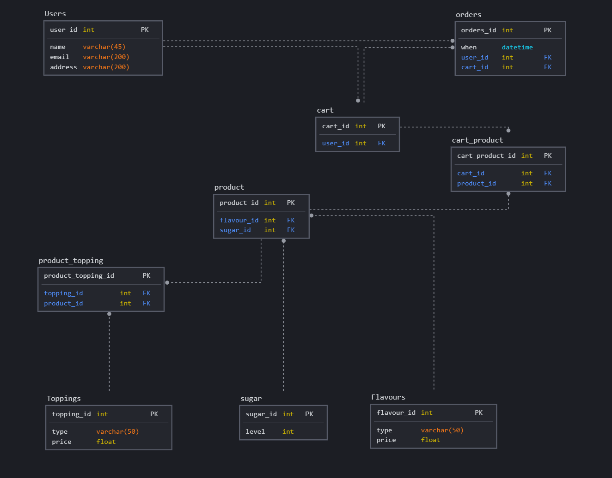

# Assignment 3 - Fullstack Web Development Project

## Main technologies

NodeJS framework(Adonis) and React

## Objectives 

1. Create a full-stack application using a fullstack high-level framework that makes use of the following features of the framework: user authentication, user authorisation, routing and ORM 
2. Create an online payment and integrate a third-party payment gateway, such as Stripes 
3. Have content or features that are accessible only by authorized users 
4. Create a single page application using React and use HTTP requests to consume endpoints written specially for it.

# Title: Suck it

A e-commerce website to allow user to come in and purchase bubble tea. Every drink can be selected and customise according to the user specifications. 

for this assignment:
* MySql will be use as the database.
* Adonis will be used to create the API to link the database.
* React will be used to create the frontend experience

## ReactJs

1. To feature the reactive interface of the website. 
2. To allow the user to interact with the website. 
3. Primay will consists of a navbar and a hero image.

## API-Adonis

1. To create CRUD for the react 
2. To talk to the database (MySql) for react.
3. To handle the STRIPE payment
4. To handle the image posting 

## Admin page

1. To be able to check users available
2. To be able to edit the database of catalog
3. To be able to check purchase status

# Operational Scope and Strategy

## Strategy

site owners goal
* business to consumer model
* clear pricing of the product to minimise confusion
* clear display of the branding and motive of the website
* “click to buy” simple access website

Identifying the users
* bubbletea lover 
* curious consumer

Needs of the user
* an easily navigation to purchasing the product 
* catalog of available producs
* to target all levels of IT literacy users
* expecting to have a smooth and fuss free process

## Strategy - User Stories
As a user:
* I will want to be able to browse thru the different selections of products available.
* I will want to be able to make different selections to my bubble tea options
* I want to have a fuss free check out process
* I will want to be able to know what i have purchased and that my order is confirmed. 

## Scope

## functional requirement

* allow users to log in 
* allow users to customise the bubble tea selections 
* allow users to know that purchased confirmed
* allow user to be able to browse thru the different selections of products
* allow a seamless checkout process

## Content Requirement

* product catalog
* process information - how to purchase
* personal purchase information

## Optional
* testimonial
* feedback
* suggestion

# Database ER diagram

# Database Schema diagram

